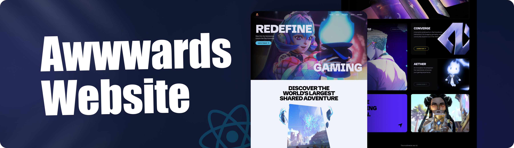

# 🏆 Awwwards Website

<div align="center">
  
  <p align="center">
    <a href="#características">Características</a> •
    <a href="#tecnologías">Tecnologías</a> •
    <a href="#instalación">Instalación</a> •
    <a href="#uso">Uso</a> •
    <a href="#estructura">Estructura</a>
  </p>
</div>

## 🌟 Descripción General

Una aplicación web moderna construida con React y Vite, que presenta una experiencia de usuario dinámica e interactiva. Este proyecto utiliza tecnologías de vanguardia para crear una plataforma visualmente impresionante y altamente funcional.

## ✨ Características

| Categoría          | Características                                                                    |
| ------------------ | ---------------------------------------------------------------------------------- |
| 📱 **Diseño**      | • Totalmente responsive<br/>• Interfaz moderna<br/>• Experiencia de usuario fluida |
| 🎥 **Multimedia**  | • Galería de videos dinámica<br/>• Interacción con videos en tiempo real           |
| 🎨 **Estilo**      | • Animaciones GSAP personalizadas<br/>• Fuentes tipográficas exclusivas            |
| ⚡ **Rendimiento** | • Optimización de carga<br/>• Transiciones suaves                                  |

## 🛠️ Tecnologías

<table>
  <tr>
    <th>Tecnología</th>
    <th>Versión</th>
    <th>Propósito</th>
  </tr>
  <tr>
    <td> React</td>
    <td>18.3.1</td>
    <td>Framework principal</td>
  </tr>
  <tr>
    <td> Vite</td>
    <td>6.0.7</td>
    <td>Build tool y desarrollo</td>
  </tr>
  <tr>
    <td> Tailwind CSS</td>
    <td>3.4.17</td>
    <td>Framework CSS</td>
  </tr>
  <tr>
    <td>🎭 GSAP</td>
    <td>3.12.5</td>
    <td>Animaciones</td>
  </tr>
</table>

## 🚀 Instalación

```bash
# Clonar el repositorio
git clone https://github.com/LostoVayne/awwwards.git

# Instalar dependencias
npm install

# Iniciar servidor de desarrollo
npm run dev
```

## 💻 Uso

### Galería de Videos Interactiva

```javascript
// Ejemplo de interacción con la galería
const handleVideoClick = (videoId) => {
	// Cambiar video actual
	setCurrentVideo(videoId);
	// Activar animación GSAP
	gsap.to(videoRef.current, {
		scale: 1.2,
		duration: 0.5
	});
};
```

## 📁 Estructura

```bash
awwwards/
├── 📂 public/
│   └── 🖼️ resource.png
├── 📂 src/
│   ├── 📂 components/
│   │   ├── 🔘 Button.jsx
│   │   └── 🎯 Hero.jsx
│   ├── 📄 App.jsx
│   ├── 🎨 index.css
│   └── 📄 main.jsx
```

### Componentes Principales

<table>
  <tr>
    <th>Componente</th>
    <th>Descripción</th>
    <th>Estado</th>
  </tr>
  <tr>
    <td>🎯 Hero.jsx</td>
    <td>Componente principal con galería de videos</td>
    <td>✅ Estable</td>
  </tr>
  <tr>
    <td>🔘 Button.jsx</td>
    <td>Botón reutilizable con estilos personalizados</td>
    <td>✅ Estable</td>
  </tr>
  <tr>
    <td>📱 App.jsx</td>
    <td>Componente raíz de la aplicación</td>
    <td>✅ Estable</td>
  </tr>
</table>

## Caracteristicas que faltan agregar

- [] Agregar Clip Path a la imagen del about para que tenga el efecto de un rombo
- [] Agregar Animacion a la card usando eventos del mouse para moverla al igual que las del BentoTilt
- [] Agregar animacion al mini video del hero para que se expanda correctamente
- [] Agregar elementos absolute junto a la imagen del about para que se puedan mover con el mouse
- [] Optimizar los recursos correspondientes a videos para reducir su peso

## 🤝 Contribución (Se aceptan Pull Requests)

1. Fork el repositorio
2. Crea tu rama de características (`git checkout -b feature/NuevaCaracteristica`)
3. Commit tus cambios (`git commit -m 'Añadir nueva característica'`)
4. Push a la rama (`git push origin feature/NuevaCaracteristica`)
5. Abre un Pull Request

## 📄 Licencia

Este proyecto está bajo la Licencia MIT. Ver el archivo `LICENSE` para más detalles.

---

<div align="center">
  <p>¿Te gusta este proyecto? ¡Dale una ⭐!</p>
  <p>Creado con ❤️ por <a href="https://github.com/yourusername">Deus lo Vult</a></p>
</div>
